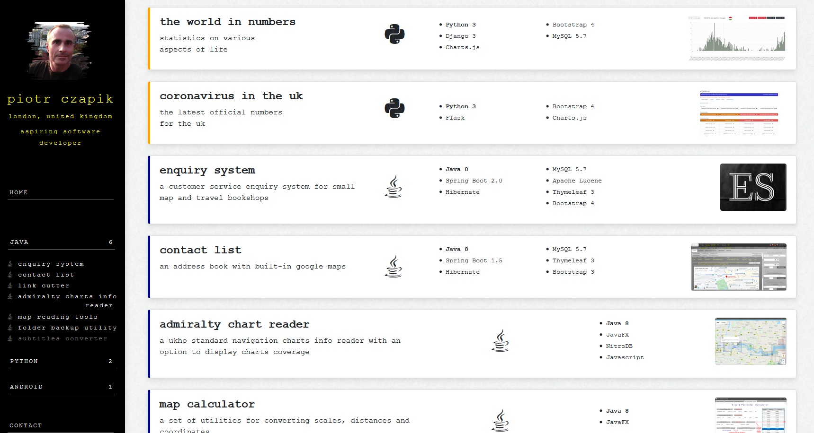
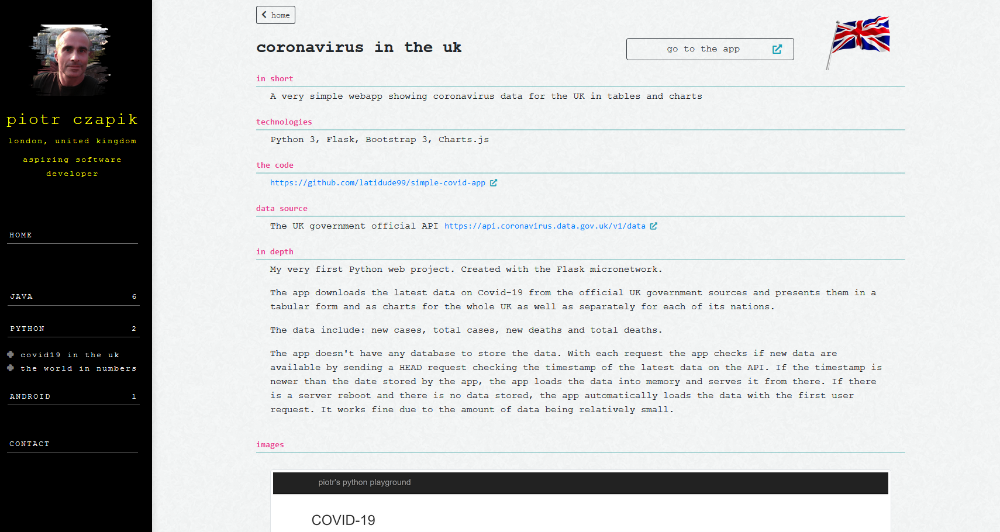
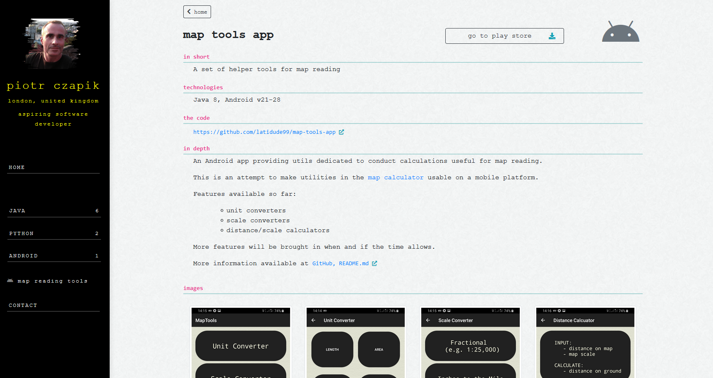
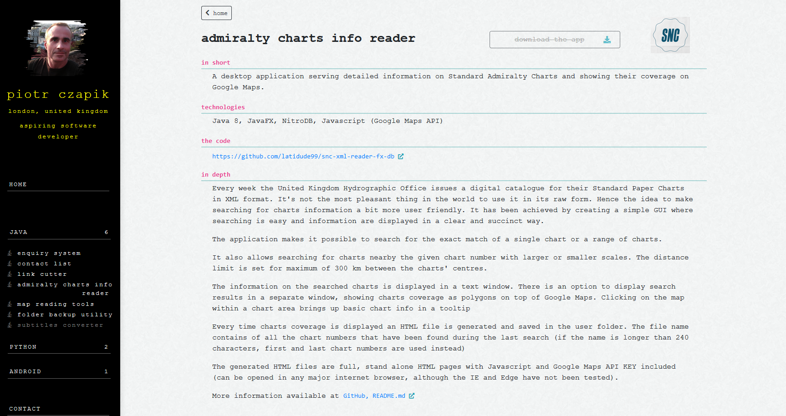
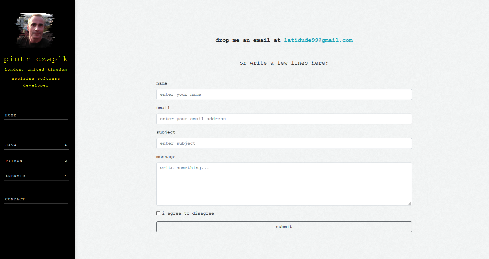
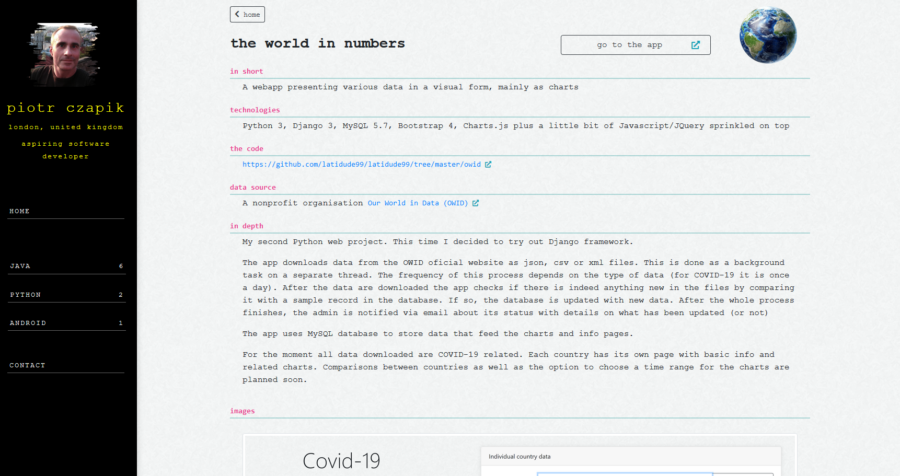

# latidude99 

Live at: [http://pc.latidude99.com](http://pc.latidude99.com)
  
## General Info

My personal website showing most of my projects in one place.
Each project has it's own page with basic info and links to Github repository.
Links to live demo provided where appropriate.

Includes a 'contact me' page with messages emailed to me and stored in a database.

## Technologies
- Python 3.8
- Djano 3.1
- MySQL 5.7
- Bootstrap 4

# Screenshots

  

   

  

   

	 

   

	

    
 

	

  

	

# Contact
You can email me at latidude99@gmail.com

<!--
**latidude99/latidude99** is a ✨ _special_ ✨ repository because its `README.md` (this file) appears on your GitHub profile.

Here are some ideas to get you started:

- 🔭 I’m currently working on ...
- 🌱 I’m currently learning ...
- 👯 I’m looking to collaborate on ...
- 🤔 I’m looking for help with ...
- 💬 Ask me about ...
- 📫 How to reach me: ...
- 😄 Pronouns: ...
- ⚡ Fun fact: ...
-->
