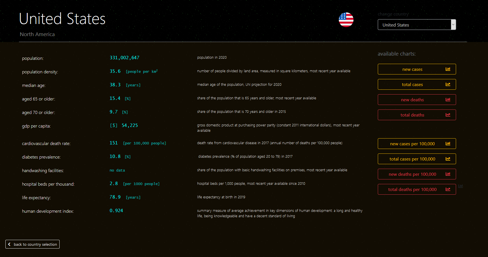
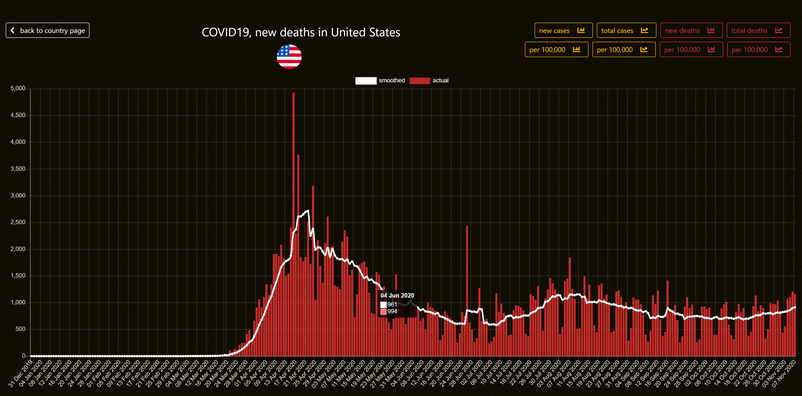
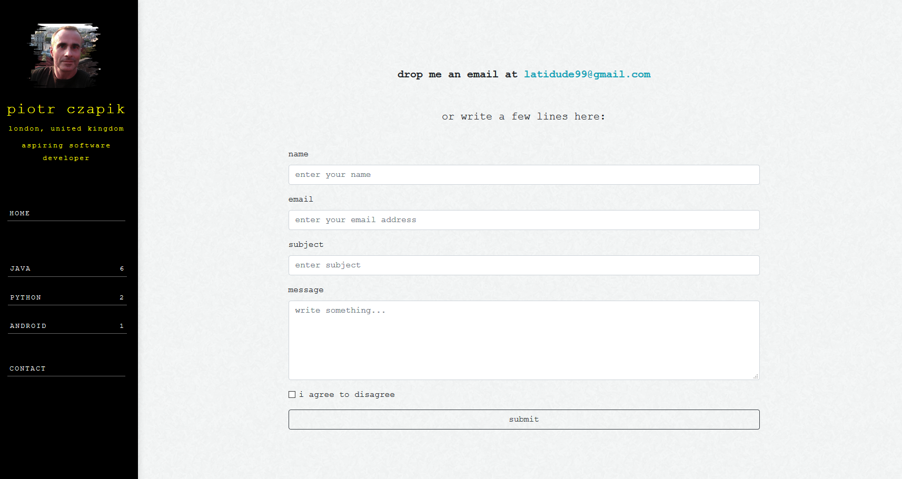

# The World in Numbers 

Live at: [http://pc.latidude99.com/owid/](http://pc.latidude99.com/owid/)
  
## General Info

My second Python project.  
Presenting various data in charts and tables.  

Phase one: COVID-19  
Phase two: CIA Factbook  

## Technologies
- Python 3.8
- Django 3.1
- MySQL 5.7
- Bootstrap 4.5.2
- Bootstrap-select 1.13.14
- JQuery 3.5.1
- Chart.js 2.9.3

# Screenshots

  

   

  

   

	 

	

	 

	

	 

	

	 

   

	

    
   

	 

	

	 

	

	 

	

	 

 

	

   

	

    

# Contact
You can email me at latidude99@gmail.com

<!--
**latidude99/latidude99** is a ✨ _special_ ✨ repository because its `README.md` (this file) appears on your GitHub profile.

Here are some ideas to get you started:

- 🔭 I’m currently working on ...
- 🌱 I’m currently learning ...
- 👯 I’m looking to collaborate on ...
- 🤔 I’m looking for help with ...
- 💬 Ask me about ...
- 📫 How to reach me: ...
- 😄 Pronouns: ...
- ⚡ Fun fact: ...
-->
