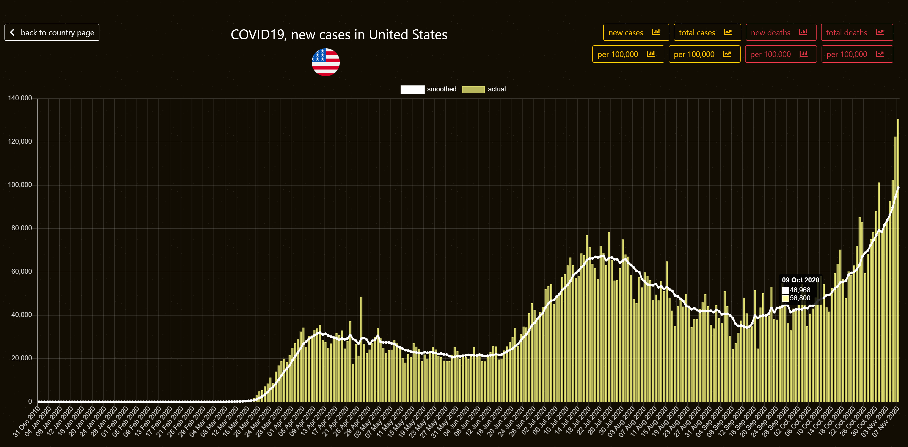
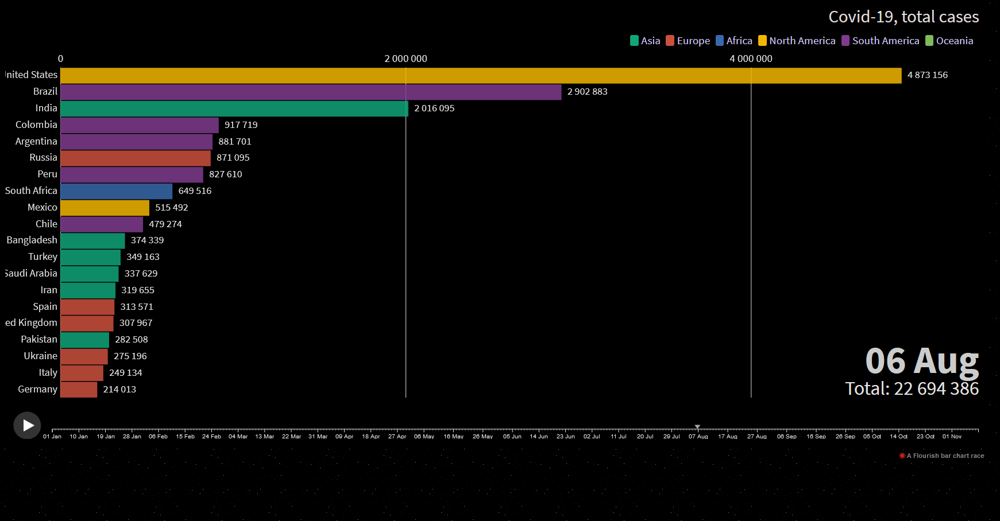

# The World in Numbers 

Live at: [http://pc.latidude99.com/owid/](http://pc.latidude99.com/owid/)
  
## General Info

My second Python project.  
Presenting various data in charts and tables.  

Phase one: COVID-19  
Phase two: CIA Factbook  

## Technologies
- Python 3.8
- Django 3.1
- MySQL 5.7
- Bootstrap 4.5.2
- Bootstrap-select 1.13.14
- JQuery 3.5.1
- Chart.js 2.9.3

## Features

The main page shows the latest numbers for each continent.  
 
### COVID-19

#### Section I - Single country data and charts

Shows charts and statistics on the selected country:
- population
- population density
- median age
- gdp per capita
- life expectancy
- cardiovascular death rate
- diabetes prevalence
- etc.

Charts available:
- new cases / new cases per 100,000 population (bar charts)
- total cases / total cases per 100,000 population (line charts)
- new deaths / new deaths per 100,000 population (bar charts)
- total deaths / total deaths per 100,000 population (line charts)

#### Section II - Multiple country data and charts

 Data and charts types are the same as in the previous section but for up to 5 countries.  
 This allows a direct comparison between countries.
 
 Choosing the time period shown on charts is also possible.
 
 #### Section III -  Latest numbers and charts
 
 This section shows the latest data for all countrues in a tabular form.
 
 - you can switch between the latest data and one or two days back for the whole table (page reload)
 - you can swap between the latest data and one or two days back for individual countries (AJAX)
 - you can sort the table by any column
 - you can filter and search the whole table including alphanumeric and numeric entries
 - you can use pre-defined filters by continents

Clicking on the country name brings up a modal with a table showing data for that country from the beginning of the year (AJAX).  
The table is sorted chronologically, the latest numbers first.  

Clicking on the numbers in any country row brings up a modal with a relevant chart (bar or line) showing data from 90 days ago to the latest.  
Charts available:
- new and total cases
- new and total deaths
- new cases per 1 million
- new deaths per 1 million
    

#### Section IV -  Race charts
 
 Total cases and total deaths race charts made with the excelent Flourish service.
 
## CIA Factbook
Works on this part will commence soon(ish)

## Screenshots

  

   

  

   

	 

	

	 

	

	 

	

	 

   

	

    
   

	 

	

	 

	

	 

	

	 

 

	

   

	

    
   

	

	

	

	

	

	

	

	

	

	

	

	

	

	

	

	

	

	

	

	

# Contact
You can email me at latidude99@gmail.com

