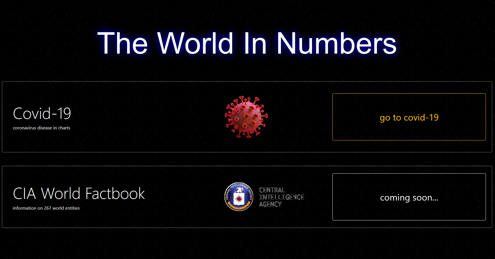
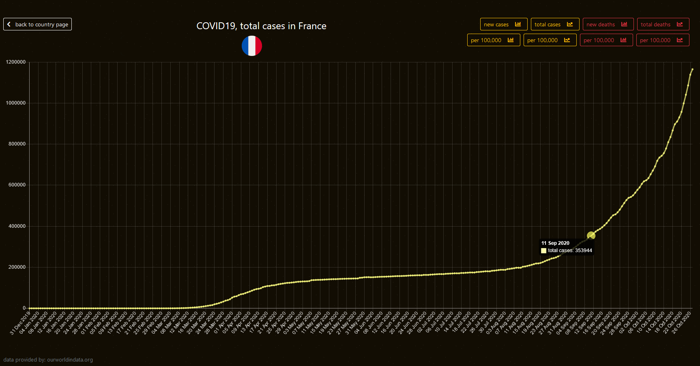
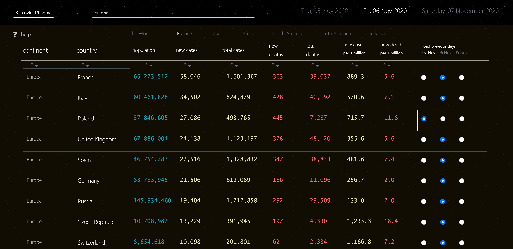
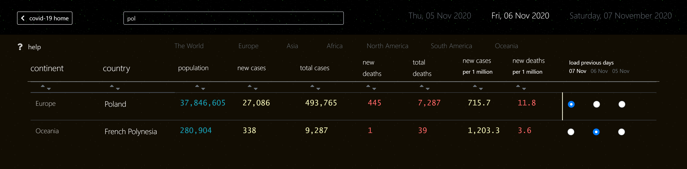
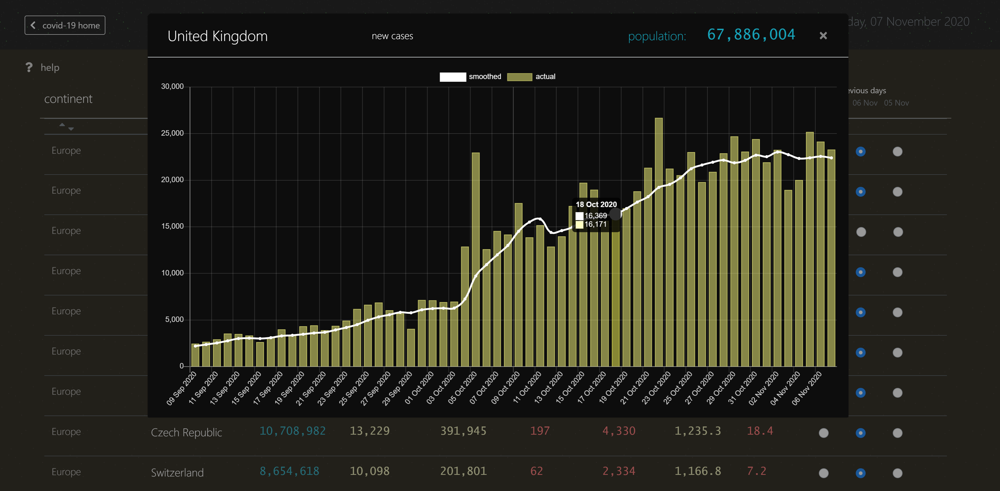
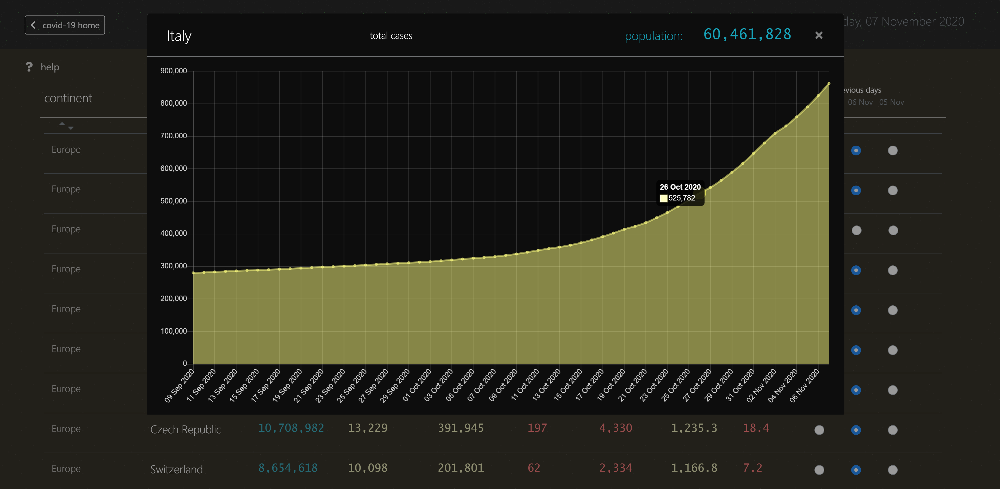
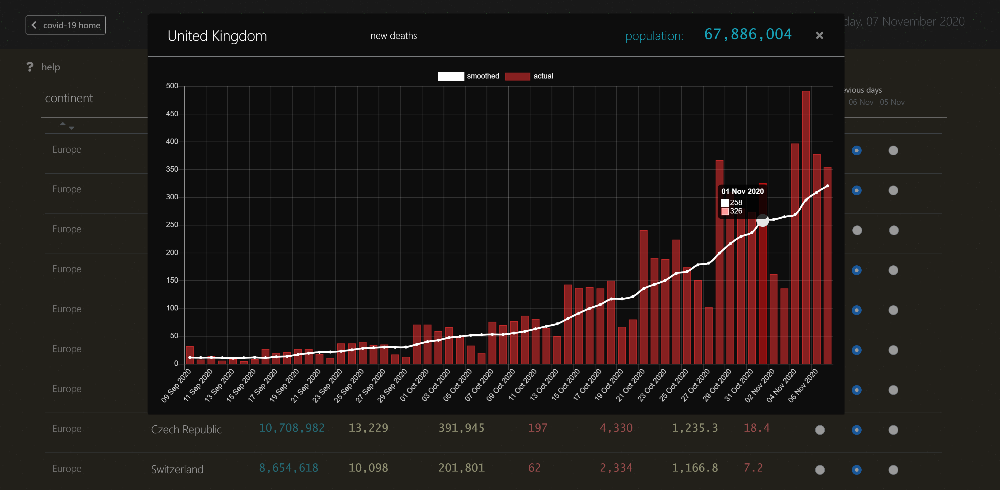
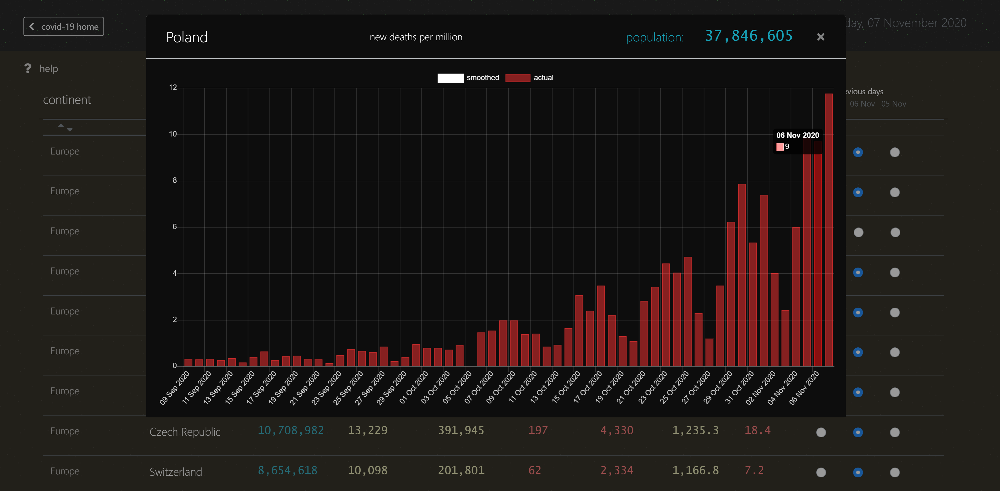

# Price Tracking Service

Live at: [http://pc.latidude99.com/pricecheck/](http://pc.latidude99.com/pricecheck/)
  
## General Info

My third Python project.  
A service allowing users to track price changes of products they find online.

Phase one: Amazon  
Phase two: John Lewis, Argos

## Technologies
- Python 3.8
- Django 3.1
- MySQL 5.7
- Bootstrap 4.5.2
- JQuery 3.5.1
- Chart.js 2.9.3

## How it works

The idea behind it is for users to find an item they want ot buy on Amazon UK (other sites to be added later) and use this service to track price changes. Users are notified by email whenever the price goes up or down allowing them to pick the best time to buy. Price checking is conducted 5 times a day.

First, a link to the product goes through the validation process that checks if the service recognizes the URL and is able to detect the product details (e.g. the name, price and currency).

Then the product can be submitted for tracking, with minimum necessary information:

 - user name and email address
 - url to the product - this gets copied automatically after successful validation to avoid typos or copying errors
 - tracking duration (in days)
 - upwards and downwards price movement thresholds
 - promo code (optional) that unlocks extra features such as extended tracking period and maximum number of items being tracked simultaneously by one user
 
After the product's submition an email with the confirmation link is sent out - nothing is tracked until the user's email address is confirmed.

Once confirmed the user will receive an email whenever the product's price changes more than the upwards or downwards thersholds, it will contain the old and new prices as well as track and stop codes.

Detailed information on price history in charts and tables can be accessed from the home page with a unique track code for each product.

Tracking can be stopped at any time with a unique stop code for each product.

Users are able to see a detailed list of all products they have been tracking entering their email address and the unique user ID (generated when the email address is submitted for the first time) 
 

## Screenshots

  

   

  

   

	 

	

	 

	

	 

	

	 

   

	

    
   

	 

	

	 

	

	 

	

	 

 

	

   

	

    
   

	

	

	

	

	

	

	

	

	

	

	

	

	

	

	

	

	

	

	

	

# Contact
You can email me at latidude99@gmail.com

