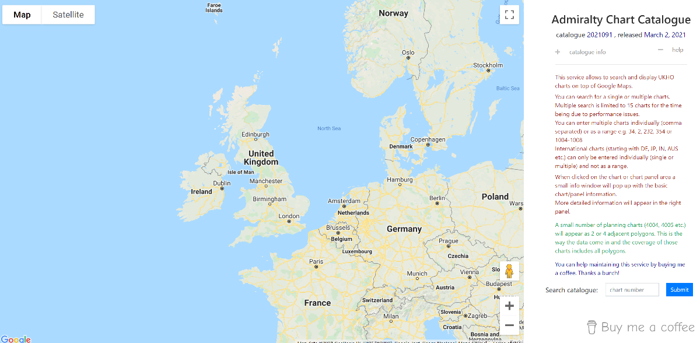
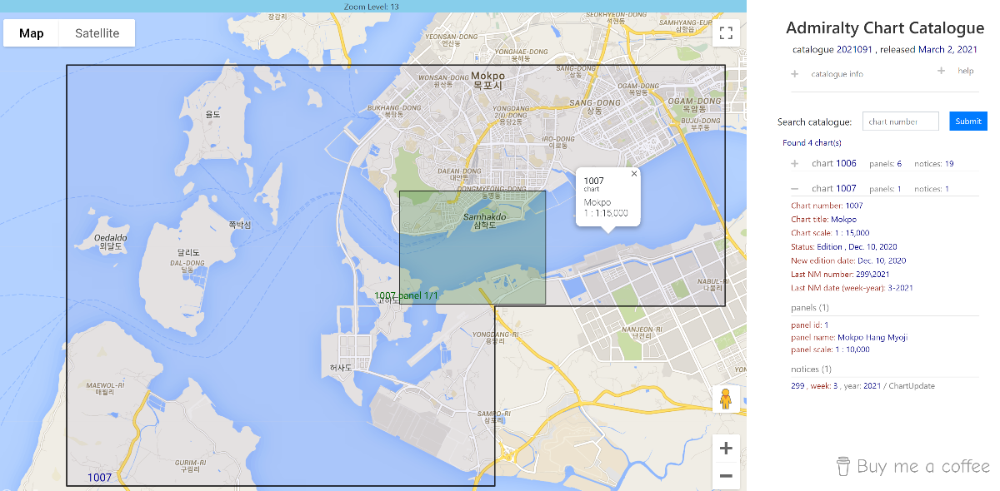
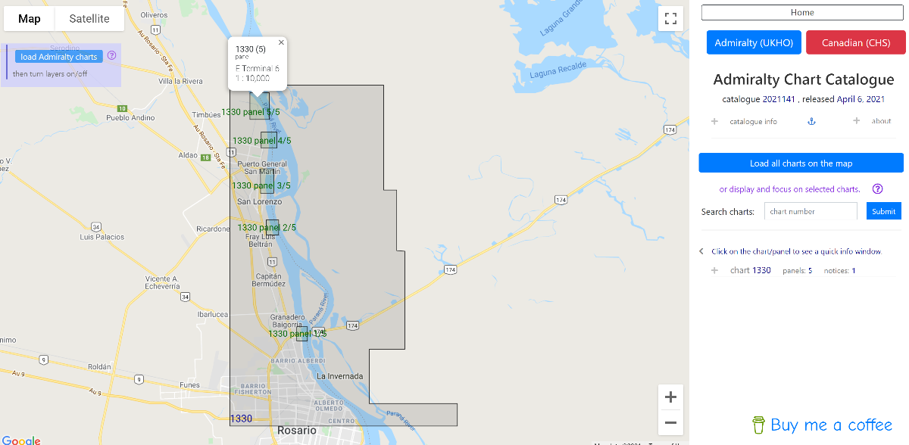
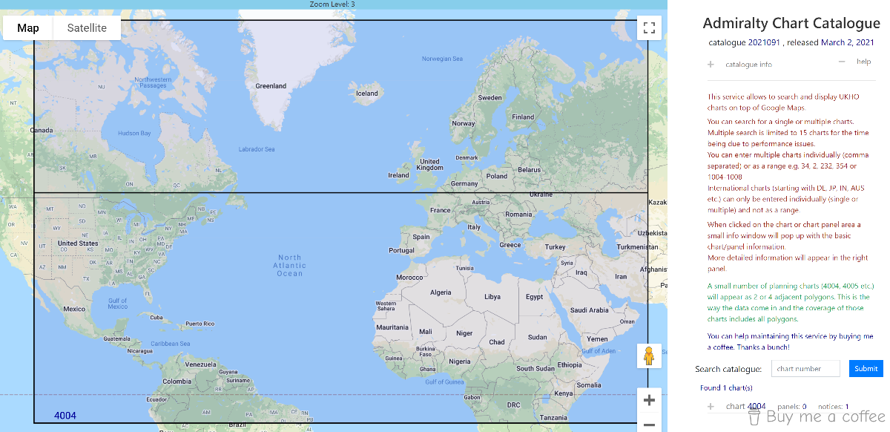

# Admiralty Charts Catalogue

<!--Live at: [http://pc.latidude99.com/snc/](http://pc.latidude99.com/snd/)-->
  
## General Info

My fourth Python project.  
A service displaying coverage of the UKHO Standard Navigational Charts on Google Maps.

## Technologies
- Python 3.8
- Django 3.1
- MySQL 5.7
- Bootstrap 4.5.2
- JQuery 3.5.1
- Google Maps Javascript API v.3

## How it works

The application makes it possible to search for the exact match of a single chart or a range of charts.

Detailed information of the found chart is displayed in the right panel. That includes basic info such as scale, edition date, last NM number and date as well as number of panels with their names and scales. Also, lists all the Notices to Mariners for the chart, starting with the latest one.

The charts coverage is shown on the left side on top of Google Maps 

## Screenshots

   

  

   

 

	
 

# Contact
You can email me at latidude99@gmail.com

