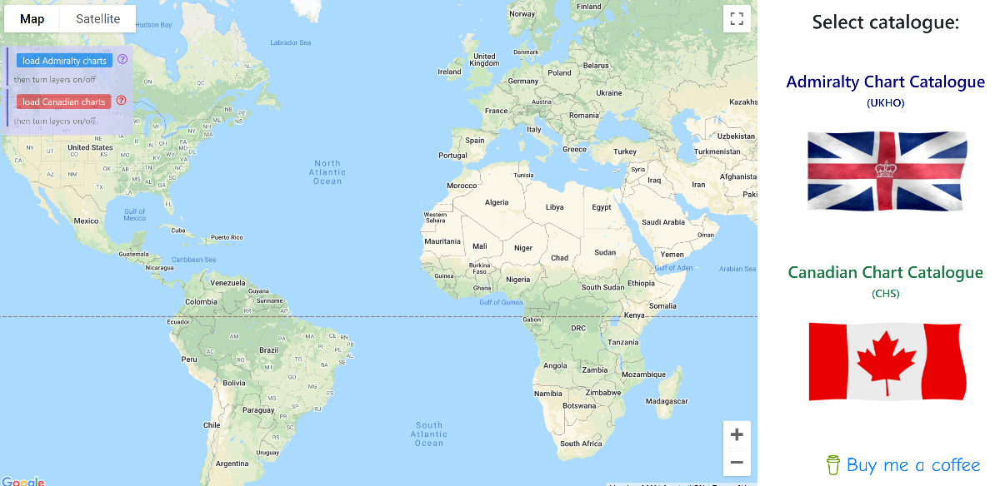
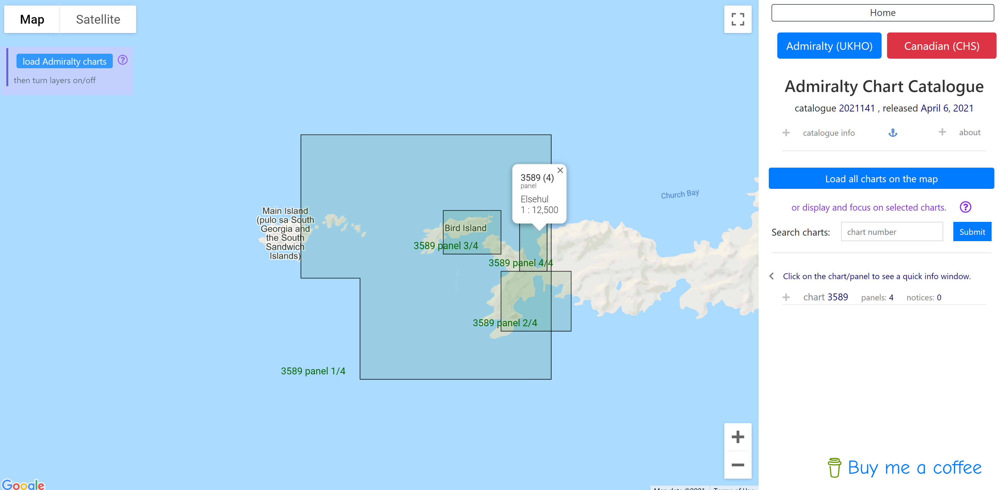
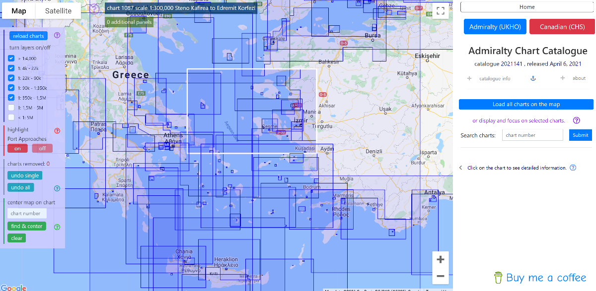
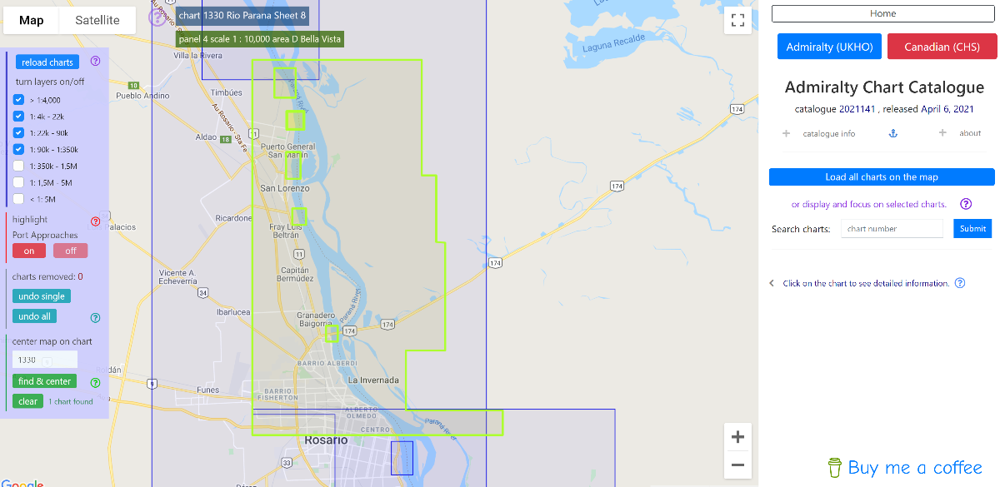

# Admiralty Charts Catalogue

<!--Live at: [http://pc.latidude99.com/snc/](http://pc.latidude99.com/snd/)-->
  
## General Info

My fourth Python project.  
A service displaying coverage of the UKHO Standard Navigational Charts on Google Maps.

## Technologies
- Python 3.8
- Django 3.1
- MySQL 5.7
- Bootstrap 4.5.2
- JQuery 3.5.1
- Google Maps Javascript API v.3

## How it works

The application serves as an online Admiralty Standard Navigational Charts catalogue with charts coverage and basic info displayed on top of Google Maps. The catalogue data are taken from xml files issued by the UKHO weekly and parsed into an SQL database.

There are two main modes you can use:

- Selected charts detailed info and focus  
	- Allows you to search, isolate and display only single or a few charts. It assumes you already know the chart number(s) and want to check their coverage and/or information on scale, last edition date and notices to mariners.

- All charts coverage display and info.  
	- Meant for those who want to see what charts are available in their area of interest.
	- Hovering over a chart or panel polygon triggers top info bars with basic info such as chart/panel number, title and scale.
	- Clicking on a chart or panel polygon fetches detailed information and displays it on the right side next to the map window.
	- Allows to switch on/off selected scale ranges for clarity.
		-  > 1:4,000
		- 1:4,000 - 1:22,000
		- 1:22,000 - 1:90,000
		- 1:90,000 - 1:350,000
		- 1:350,000 - 1:1,500,000
		- 1:1,500,000 - 5,000,000
		- < 1:5,000,000
	- Last map position and zoom level are remembered when using options available within the service. May not work on page reload using browser's buttons.
	- Gives an option to load Port Approaches charts on a separate layer and switch that layer on and off independently from all the other layers.
	- To improve clarity chart and panel polygons can be removed from the map on a one by one basis by the right mouse click. This is temporary and can be reverted also one by one in the reverse order.
	- Allows to search for a single chart - if found it highlights the chart in light green colour and centres the map on it

## Screenshots

   

  

   

 

 

 

 

 

 

	
 

# Contact
You can email me at latidude99@gmail.com

